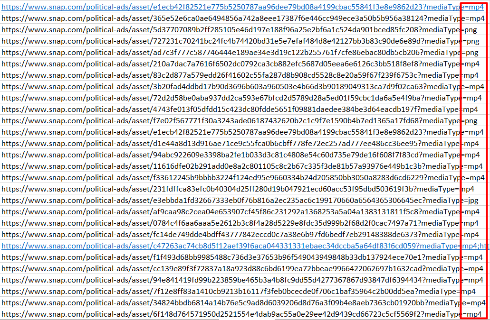
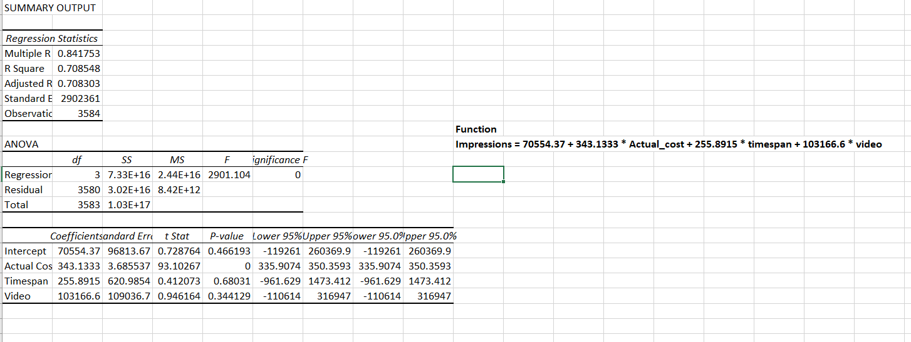
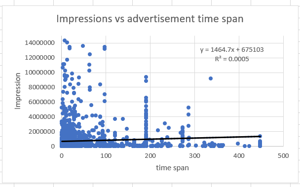
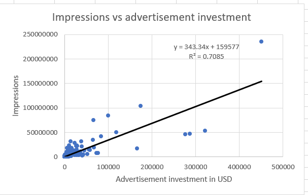
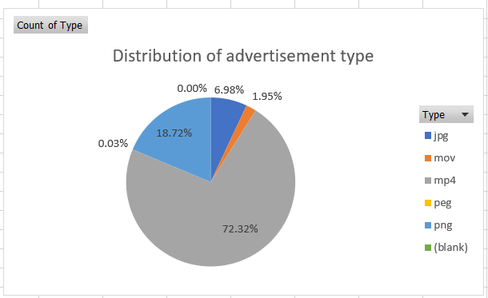
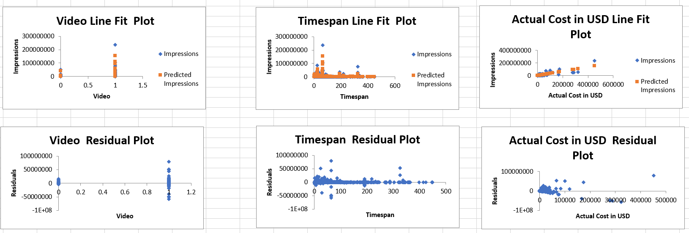

# Mini-project 2: The influence of timespan, investment and format on the impressions of political advertisement

# Summary of the project 

- The project is tot discuss the relationship among the impressions of Snapchat political advertisement, the investment of those campaigns, the format of advertisement and the period that the advertisement alive on the platform. I preprocess all the three different types of data. In order to get a better result on the prediction, I did both single variable regression and multi-variable regression. The function of multi-variable is Impressions = 70554.37 + 343.1333 * Actual_cost + 255.8915 * timespan + 103166.6 * video, with a R square at 0.7085. This means we can use our model to predict around 0.7 of the data in our dataset. This is a reasonable probability because impression data is really sparse and consists of many outliers. As we can see from the function, all of the three variables would have some effect to the entire performance of impressions. Using this method can, to some extent, make a more accurate decision. For future plan, we need to include more features from the dataset to make a better prediction. 

# Step-by-Step Analysis 

## Data Selection 
- I selected 2019 Snapchat political advertisement data from [here](https://www.snap.com/en-US/political-ads/). It is an open-source dataset so we don't have to worry about the legal issues. The entire data is used to increase the transparency around the political issue. It is also important for people to know the accuracy of the data. 

## Data Preprocessing 

- I deleted anything that is not related to our project and also found out that there are many errors in the data, like the end time is before the start time. This issue made me think about the accuracy of the data because the company with high reputation should not release fake data for any purposes. 
- I changed all the time format from ISO 8601 format to excel format and do some manipulation from there.(IF-ELSE statement to padding the NULL value) 
- Also for the price of the add, I converted it to the current amount of US Dollar based on the currency exchange rate provided by Google. (Use VLOOKUP to check the specific rate). 
- For the format of the application, I parsed the link and get the last three characters to be the format of the advertisement like "mp4". Then, I used IF-ELSE statement to decide which one is video(1) and which one is picture(0). The image below can show how I parse the formate information. 

- 

## Data Analysis
- As I mentioned before, R square is around 0.7 which means my model could describe 0.7 of the total number. 
- Impressions = 70554.37 + 343.1333 * Actual_cost + 255.8915 * timespan + 103166.6 * video. Looking at the coefficient of the multi-variable regression, all the coefficients are positive which indicate the increase of each variable would increase the entire impression. 
- The summary of the function is shown here: 

- This figure indicate that the value of investment is very significant in predicting the result since it has a p-value at 0. However, other two factors would be less significant. 

# File Specification 
- `PoliticalAds.csv` is the original data I get from the website
- `2019.xlsx` is the result excel table with all the work I did for the project
    - `Currency` sheet is the currency exchange rate I collected from Google
    - `PoliticalAds` sheet contains the single variable regression and all the data including raw data required for this project
    - `Distribution` sheet is a sheet to show what the proportion of ads is in the format of video
    - `Multi-regression` sheet does the multi-value regression for the project
    - `Correlation` sheet includes all the correlation between each pair of variables

# Data Visualization 

## Single variable regression 

- 

- 

## Proporation of different formats

- 

## Multi-value regression 
- 

# Discussion and Limitation

- Overall, this regression method can provide a decent accuracy to the complicated question. But the investment is still the key factor in deciding how much impressions a political advertisement can get. In order to change this situation, we need to add more features to balance out the strong influence of a very significant factor. 

- One thing that is important is the accuracy of the data. I found many errors like the formatting. For example, for some candidate the end time is before the start time, which doesn't make sense at all. I deleted those rows in order to get a better result. But it is not always a wise choice to choose to delete them because some rows would have effects on the final result if the data is correct. This is also very dangerous in real life, so I used a copy of the data to do all my work. In the future, getting a more reliable data would also be helpful to the development of the project. Data is essential for any kind of prediction.  